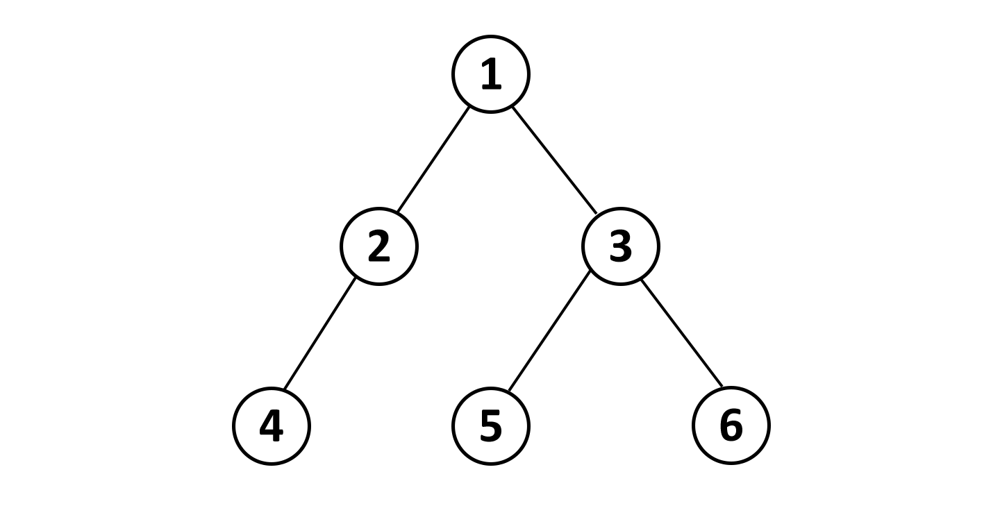

```{r setup, include=FALSE}
knitr::opts_chunk$set(echo = TRUE)
```

*Đề này iluvgirlswithglasses đã nhặt được ở đâu đó, nhưng lại mất nguồn*  
*Nay mạn phép ghi lại cho các đồng môn ngâm cứu*  
*Hi vọng mọi người sẽ nhìn thấy được ý tưởng cho atcoder dp contest câu P*

# Party

Công ty Chúng-tôi-không-wibu gồm $N$ nhân viên, mối quan hệ thứ bậc giữa các nhân viên với nhau được biểu diễn bằng một cây $N-1$ cạnh có dạng như hình sau:



Trong đó, nút $1$ là nút cao nhất đại diện cho sếp của công ty. Nếu nút $u$ cao hơn nút $v$ và $u$ là nút cha của $v$, ta gọi $u$ là **cấp trên trực tiếp** của $v$. Như minh họa trong *Figure 1*, ta có $1$ là **cấp trên trực tiếp** của $2$ và $3$, còn $3$ là **cấp trên trực tiếp** của $5$ và $6$.

Nhân ngày kỷ niệm cái nóc nhà, sếp *Khâm* muốn tổ chức một bữa tiệc thật hoành tráng với các vị khách mời là các nhân viên trong công ty. Khổ nỗi, vì môi trường làm việc thường ngày quá căng thẳng nên không có bất kỳ nhân viên nào muốn dự tiệc cùng **cấp trên trực tiếp** của mình. Lấy ví dụ trong *Figure 1*, nếu nhân viên số $3$ tham dự thì nhân viên $5$ và $6$ sẽ vắng mặt. Ngược lại, nếu $3$ vắng mặt, $5$ và $6$ sẽ sẵn lòng chung vui với số $1$.

Biết rằng nhân viên thứ $i$ sẽ mang đến $W_{i}$ điểm niềm vui. Anh *Khâm* muốn tính tổng điểm niềm vui lớn nhất trong bữa tiệc (tất nhiên anh *Khâm* phải có mặt). Nhưng vì bận chăm sóc cho cái nóc nhà nên anh muốn nhờ bạn hãy tính giá trị ấy giúp anh nhé :')

# Input & Constraints

Dòng 1: Một số nguyên dương $N$ ($N < 10^5$)  
Dòng 2: Gồm $N$ số nguyên, số thứ $i$ có giá trị $W_{i}$ ($0 < W_{i} < 10^6$)  
$N-1$ dòng tiếp theo: Dòng thứ $i$ chứa 2 số $u$ $v$, có nghĩa $u$ là cấp trên trực tiếp của $v$ ($1 \leq u, v \leq N$)

# Output

Phần dư khi chia đi cho $10^9+7$ của độ vui vẻ lớn nhất tìm được nếu anh *Khâm* tham dự.

# Resources

Memory Limit: 256MB  
Time Limit: 1s  

Gửi bài cho Đạt để Đạt chấm & feedback.

# Sample Input

```
7 
1 1 1 1 1 1 1  
2 1  
3 1  
4 2  
6 2  
5 3  
7 3  
```

# Sample Output
```5```
